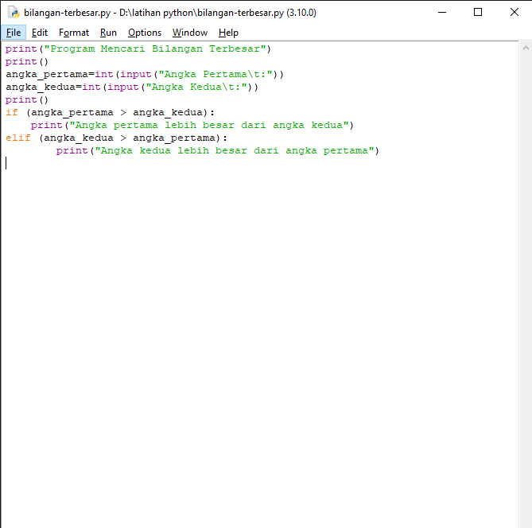
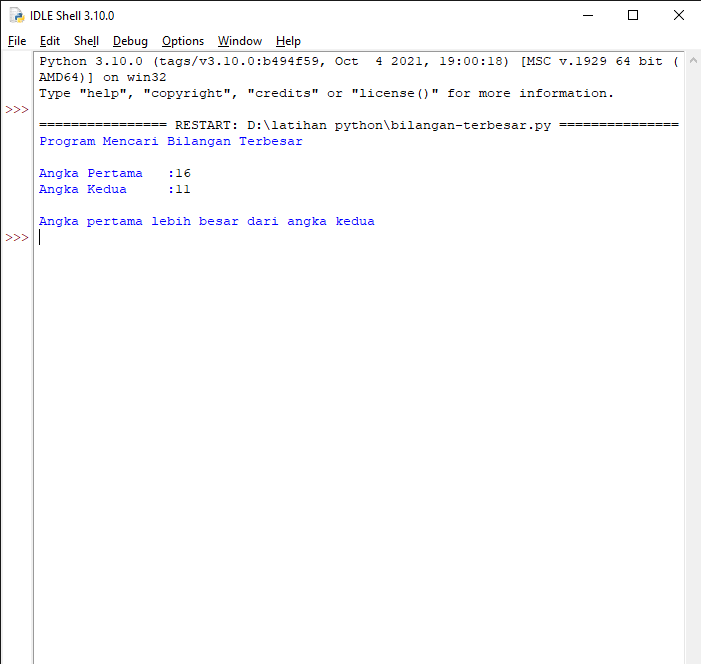
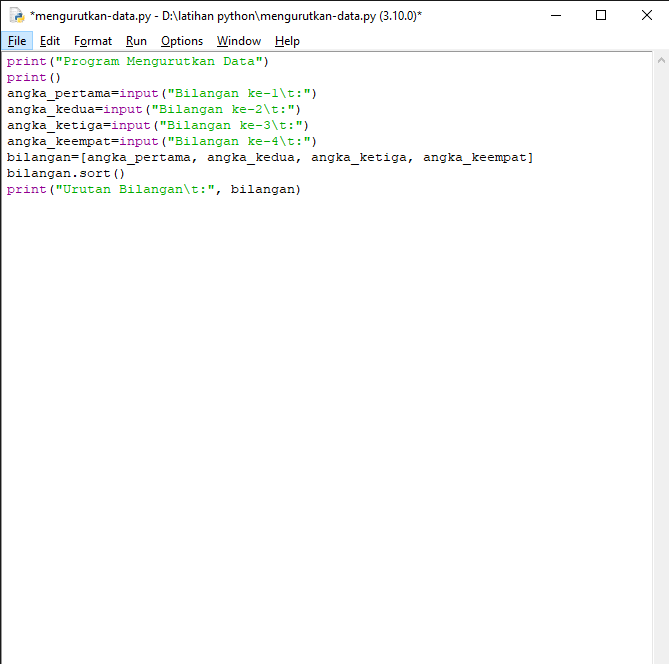
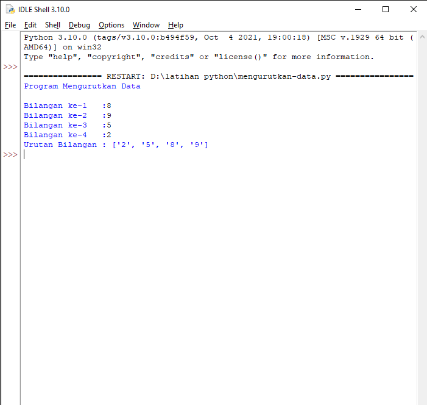
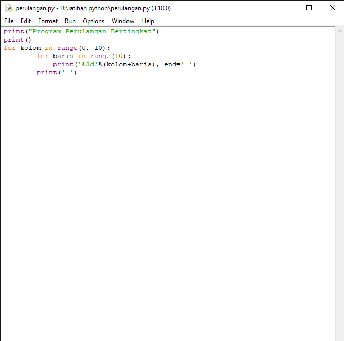
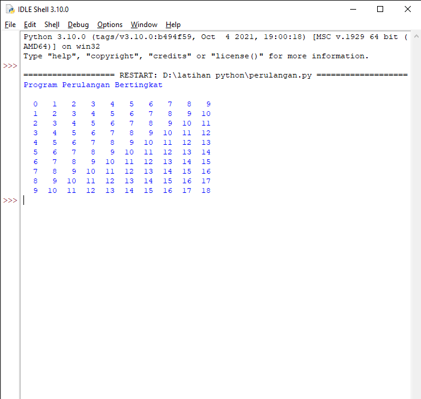
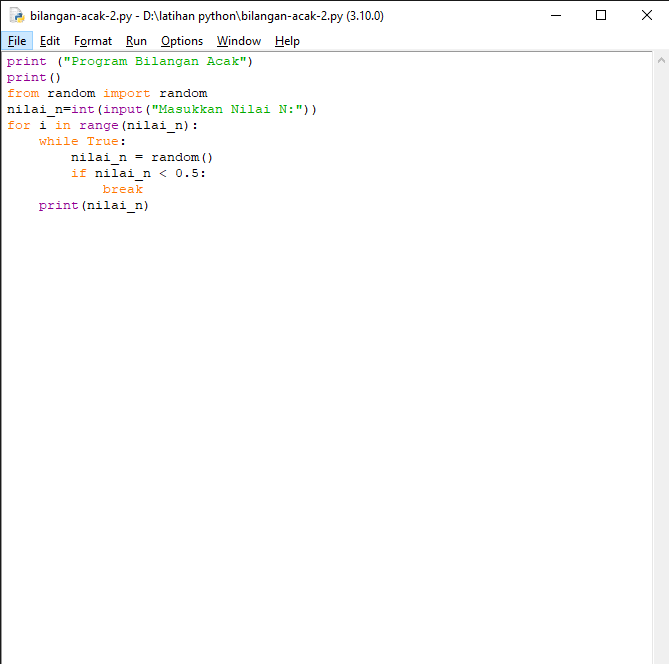

# Tugas

<h2>Latihan 1</h2>

Membuat program sederhana dengan input 2 buah bilangan, kemudian tentukan bilangan terbesar dari kedua bilangan tersebut.

<h3>-Program-</h3>



<h3>Penjelasan :</h3>

1. Masukkan 2 variable yang berupa bilangan bulat (integer).

    ```bash
        angka_pertama=int(input("Angka Pertama\t:"))
        angka_kedua=int(input("Angka Kedua\t:"))
    ```
2. Jika angka pertama lebih besar dari angka kedua, maka yang akan ditampilkan adalah "Angka pertama lebih besar dari angka kedua".

    ```bash
        if (angka_pertama > angka_kedua):
        print("Angka pertama lebih besar dari angka kedua")
    ```
3. Jika angka kedua lebih besar dari angka pertama, maka hasilnya adalah "Angka kedua lebih besar dari angka pertama".

    ```bash
        elif (angka_kedua > angka_pertama):
        print("Angka kedua lebih besar dari angka pertama")
    ```

<h3>-Output Program-</h3>



<h2>Latihan 2</h2>

Membuat program untuk mengurutkan data berdasarkan input sejumlah data, kemudian tampilkan hasilnya secara berurutan mulai dari data terkecil.

<h3>-Program-</h3>



<h3>Penjelasan :</h3>

1. Menginput 4 buah bilangan.

    ```bash
        angka_pertama=input("Bilangan ke-1\t:")
        angka_kedua=input("Bilangan ke-2\t:")
        angka_ketiga=input("Bilangan ke-3\t:")
        angka_keempat=input("Bilangan ke-4\t:")
        bilangan=[angka_pertama, angka_kedua, angka_ketiga, angka_keempat]
    ```
2. Untuk mengurutkan bilangan acak menjadi urutan data dari yang terkecil hingga yang terbesar, gunakan fungsi <b>sort()</b>.

    ```bash
        bilangan.sort()
    ```

<h3>-Output Program-</h3>



<h2>Latihan 3</h2>

Membuat program dengan perulangan bertingkat (nested) for.

<h3>-Program-</h3>



<h3>Penjelasan :</h3>

1. Agar dapat melakukan perulangan bertingkat, dimana baris dan kolom memiliki range 0-10 yang artinya hasil outputnya hanya dari 0-9. Fungsi <b>range()</b> digunakan sebagai <i>counter</i> pada perulangan for.

    ```bash
        for kolom in range(0, 10):
            for baris in range(10):
    ```
2. Menampilkan hasil perulangan.

    ```bash
            print('%3d'%(kolom+baris), end=' ')
        print(' ')
    ```
<h3>-Output Program-</h3>



<h2>Latihan 4</h2>

<ul type='disc'>
    <li>Tampilkan N bilangan acak yang lebih kecil dari 0.5</li>
    <li>Nilai N diisi pada saat runtime</li>
    <li>Anda bisa menggunakan kombinasi while dan for untuk menyelesaikannya</li>
</ul>

<h3>-Program-</h3>



<h3>Penjelasan :</h3>

1. Karena bilangan acak, maka gunakan fungsi <b>random</b>.
    
    ```bash
        from random import random
    ```
2. Masukkan variable N yang berupa bilangan bulat (integer).

    ```bash
        nilai_n=int(input("Masukkan Nilai N:"))
    ```
3. Gunakan kombinasi <b>for dan while</b> dimana perulangan for, rangenya menyesuaikan inputan dari "nilai_n". Jika "nilai_n" lebih kecil dari 0.5 maka program terhenti.

    ```bash
        for i in range(nilai_n):
            while True:
                nilai_n = random()
                if nilai_n < 0.5:
                    break
            print(nilai_n)
    ```
<h3>-Output Program-</h3>

![img] screenshot/3-2.png

<h3>Sekian Terimakasih</h3>